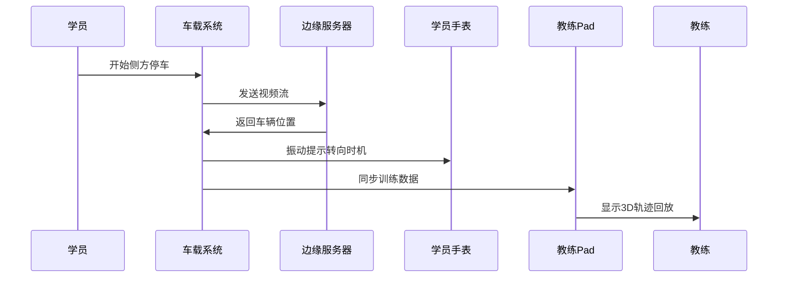

# DistributedDevice
AI分布式智能驾校练考系统 🚗✨
> 基于鸿蒙HarmonyOS的下一代智能驾驶训练解决方案
📌 项目简介
AI分布式智能驾考系统是一个利用鸿蒙分布式能力和AI技术重构传统驾驶培训的创新项目。通过将智能车载设备、学员穿戴设备、场地监控设备等多终端无缝协同，打造沉浸式、个性化、高安全的驾驶训练体验。
🌟 核心亮点
⦁	🧠 AI智能教练：实时分析驾驶行为，提供精准指导
⦁	🔗 鸿蒙分布式：多设备无缝协同，数据实时同步
⦁	🎯 个性化教学：基于学员能力的自适应训练方案
⦁	🛡️ 全方位安全：多级风险预警与应急响应机制
🚀 快速开始
环境要求
⦁	IDE: DevEco Studio 4.0+
⦁	SDK: HarmonyOS API 10+
⦁	设备: 支持鸿蒙分布式能力的设备（车机、手表、Pad等）
安装步骤
```bash

# 2. 使用DevEco Studio打开项目
# 3. 配置开发证书和设备
# 4. 运行到目标设备
```
🏗️ 系统架构
技术架构图
```
┌─────────────────────────────────────────┐
│              华为云服务                  │
│    ┌─────────┬─────────┬──────────┐    │
│    │  ModelArts │  大数据  │  对象存储  │    │
│    └─────────┴─────────┴──────────┘    │
└─────────────────┬───────────────────────┘
                  │ 5G/专线
┌─────────────────▼───────────────────────┐
│          驾校场地边缘服务器              │
│  ┌───────────────────────────────────┐  │
│  │  轻量AI模型 │ 实时分析 │ 本地数据库 │  │
│  └───────────────────────────────────┘  │
└──────┬────────────┬──────────────┬──────┘
       │            │              │
┌──────▼──┐  ┌─────▼────┐  ┌─────▼────┐
│ 智能教练车 │ │学员穿戴设备│ │场地监控设备│
│  鸿蒙车机 │ │  智能手表 │ │ 智能摄像头 │
└──────────┘ └───────────┘ └───────────┘
```
核心模块
1.	分布式设备管理 - 设备自动发现与连接
2.	AI模型管理 - 端边云协同推理
3.	数据同步 - 跨设备实时数据流转
4.	智能教练UI - 多端一致的用户体验
💡 核心功能
1. 智能驾驶行为分析
⦁	实时姿态识别：检测方向盘操作、观察动作
⦁	车辆轨迹分析：精确计算行驶路径
⦁	违规行为检测：压线、超速、操作失误等
2. 分布式协同训练
⦁	多设备同步：车机、手表、教练Pad实时联动
⦁	连续性体验：模拟器→实车训练无缝切换
⦁	远程指导：教练可远程查看和指导
3. 个性化学习路径
⦁	能力评估：基于AI分析的学习者模型
⦁	自适应课程：根据薄弱项智能推荐训练内容
⦁	进度跟踪：全流程学习数据记录
4. 智能安全守护
⦁	风险预警：生理指标+行为分析双重监测
⦁	应急响应：多级安全干预机制
⦁	事故预防：危险场景提前预警
🛠️ 开发指南
项目结构
```
smart-driving-school/
├── ets/                          # 业务代码
│   ├── MainAbility/              # 应用入口
│   ├── manager/                  # 管理模块
│   │   ├── AIManager.ts          # AI推理管理
│   │   ├── DistributedDeviceManager.ts
│   │   └── DistributedDataManager.ts
│   ├── model/                    # 数据模型
│   └── utils/                    # 工具类
├── resources/                    # 资源文件
└── module.json5                  # 模块配置
```
关键API使用
设备发现与连接
```typescript
const deviceManager = new DistributedDeviceManager();
await deviceManager.discoverAndConnect();
```
AI模型推理
```typescript
const aiManager = new AIManager();
const result = await aiManager.poseDetection(cameraFrame);
```
数据同步
```typescript
const dataManager = new DistributedDataManager();
await dataManager.syncTrainingData(trainingData);
```
📱 使用场景
场景1：侧方停车训练

场景2：远程安全监控
```
1. 学员手表检测心率异常 ↑
2. 车载系统收到预警信号 ⚠️
3. 教练Pad弹出告警窗口 🔴
4. 场地监控中心大屏高亮显示 📺
5. 安全员收到指令前往查看 👨‍🚒
```
📊 性能指标
| 指标 | 目标值 | 说明 |
|------|--------|------|
| 端到端延迟 | <200ms | 从动作到反馈 |
| 识别准确率 | >95% | 关键动作识别 |
| 设备连接时间 | <3s | 设备自动发现连接 |
| 模型推理速度 | 30fps | 本地轻量模型 |
🔧 部署方案
硬件需求
| 设备类型 | 规格要求 | 数量 |
|---------|---------|------|
| 智能教练车 | 鸿蒙车机 + 多路摄像头 | 按车辆数 |
| 边缘服务器 | 16核CPU + 32G内存 + GPU | 每场地1台 |
| 穿戴设备 | HarmonyOS手表 | 按学员数 |
| 教练终端 | HarmonyOS Pad | 按教练数 |
网络配置
⦁	车场内网: Wi-Fi 6全覆盖
⦁	边缘连接: 5G CPE或专线
⦁	云端连接: 100Mbps以上带宽
📈 效果展示
训练效果提升
```
传统驾校 vs 智能驾校对比：
├── 平均拿证时间：4个月 → 2.5个月 📉
├── 一次通过率：65% → 92% 📈
├── 事故率：3% → 0.5% 🛡️
└── 教练效率：1对3 → 1对8 🚀
```
学员体验改善
```yaml
智能功能:
  - 实时语音指导: "方向盘向左打半圈"
  - 3D轨迹回放: 可视化操作轨迹
  - 个性化提示: 针对薄弱项重点训练
  - 安全守护: 7×24小时风险监测
```
🤝 贡献指南
欢迎提交Issue和Pull Request！
1.	Fork本项目
2.	创建功能分支 (`git checkout -b feature/AmazingFeature`)
3.	提交更改 (`git commit -m 'Add some AmazingFeature'`)
4.	推送到分支 (`git push origin feature/AmazingFeature`)
5.	开启Pull Request
📄 许可证
本项目基于 Apache License 2.0 开源协议。详见 LICENSE 文件。
<div align="center">
让驾驶培训更智能、更安全、更高效 🚀
Powered by HarmonyOS & AI
</div>
